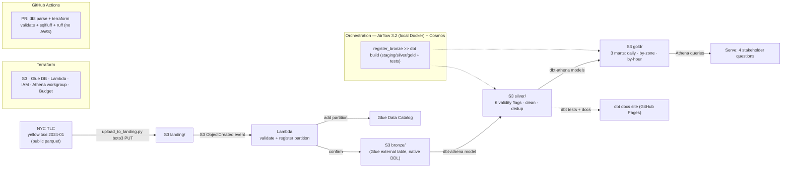

# Project 3 — NYC TLC Yellow Taxi Pipeline on AWS (build brief)

**Repo:** `project3-aws` · **Portfolio position:** third of four implementations of the *same* NYC TLC business problem (ingest → clean → model → serve), so the platform trade-offs can be compared directly in interviews.

- Project 1 — GCP + Databricks (Delta Lake) — ✅ done
- Project 2 — Snowflake + dbt — ✅ done
- **Project 3 — AWS + dbt-athena — this brief**
- Project 4 — Terraform / IaC + GenAI bolt-on — planned

> Per the plan, this is **the smallest of the four** — just enough to credibly claim hands-on AWS in interviews. The differentiator is a **serverless, cost-aware AWS lakehouse** where every component is pay-per-use and the standing cost when idle is effectively zero — a deliberate contrast to Redshift/MWAA, which bill by the hour. That cost story *is* the senior talking point. Transformation reuses the **same dbt models from Project 2 on a different adapter (dbt-athena)** — the "same models, swapped warehouse" comparison is the second senior talking point.

---

## 1. Objective

Port the ingest + Bronze/Silver/Gold layers of the NYC TLC pipeline to AWS using a serverless, free-tier-only architecture, and demonstrate senior AWS data-engineering judgement: event-driven ingest, a Glue-catalogued S3 lakehouse, **dbt-athena** transformations, orchestration with Airflow 3.2, full IaC in Terraform, least-privilege IAM, and explicit cost-aware decisions documented as ADRs — all reproducible from a clean clone and tearable-down with `terraform destroy`.

The same data-quality findings from Projects 1 and 2 (the ~95.7% Silver retention and the `total_amount` reconciliation discrepancy) must reproduce here, proving consistency of logic across three platforms.

---

## 2. Scope

**In scope**
- Ingest one month of NYC TLC Yellow Taxi data (Jan 2024, ~2.96M rows) — same partition as Project 1, for comparability.
- **Event-driven ingest**: upload to an S3 `landing/` prefix triggers a Lambda that validates and registers the Bronze partition in the Glue Data Catalog.
- **Bronze**: raw parquet in S3, exposed as a Glue external table (native Athena DDL — AWS-specific, not dbt).
- **Silver**: cleaned/validated table via **dbt-athena** model, reusing the 6 validity flags from Project 1.
- **Gold**: 3 marts (daily KPIs, by pickup zone, by hour-of-day) via **dbt-athena** models — same 3 marts as Project 1.
- **Tests + docs**: dbt tests (generic + singular, incl. the `total_amount` reconciliation as WARN) and a published dbt docs/lineage site (GitHub Pages, as in Project 2).
- **Serve**: Athena queries answering the same 4 stakeholder questions as the Project 1 dashboard.
- **Orchestration**: Apache Airflow 3.2 locally in Docker — via **astronomer-cosmos** (reusing the Project 2 pattern) or the `amazon` provider, against real AWS.
- **IaC**: Terraform for all AWS resources (S3, Glue, Lambda, IAM, Athena workgroup, AWS Budget).
- **CI**: GitHub Actions running `dbt parse` (credential-free) + `terraform fmt/validate` + `sqlfluff` — never touches AWS (PRs cost nothing, mirroring Project 2).
- **Docs**: ADRs, architecture diagram, spec-driven Claude Code specs, README.

**Out of scope (deliberate — each gets an ADR)**
- **Redshift / Redshift Serverless** — Athena is the warehouse. ADR-003 documents when Redshift *would* win (sustained high-concurrency BI, sub-second SLAs).
- **MWAA (managed Airflow)** — local Airflow in Docker. ADR-005.
- **Glue Spark ETL jobs** — dbt-athena (CTAS under the hood) does transforms. ADR-006.
- **Streaming** (Kinesis/MSK) — batch only.
- **QuickSight** — not free beyond trial; serving via Athena queries + one chart from a results CSV.

---

## 3. Tech stack

| Layer | Choice | Cost |
|---|---|---|
| Cloud | AWS, region **eu-west-2 (London)** | — |
| Object store / lakehouse | Amazon S3 (`landing/`, `bronze/`, `silver/`, `gold/`, `athena-results/`) | Free tier (data ~50–200 MB) |
| Event-driven ingest | AWS Lambda (Python 3.12) triggered by S3 `ObjectCreated` | Perpetual free tier |
| Catalog | AWS Glue Data Catalog (Bronze table via native DDL; dbt manages Silver/Gold tables) | Free tier |
| Warehouse / query engine | Amazon Athena (engine v3) | $5/TB scanned → pennies; workgroup byte cap enforced |
| Transformation | **dbt-core 1.11.x + dbt-athena 1.10.x** (generates CTAS / CREATE VIEW in Athena) | Athena query cost only |
| Orchestration | Apache Airflow **3.2.x** (local, Docker) + **astronomer-cosmos** (or `amazon` provider) | Free |
| IaC | **Terraform 1.15.x** + `hashicorp/aws` provider **`~> 6.0`** (or OpenTofu 1.11.x FOSS drop-in) | Free |
| Auth | IAM least-privilege user (dev) + scoped Lambda execution role; dbt-athena uses boto3/AWS-profile creds | Free |
| CI/CD | GitHub Actions (dbt parse, terraform validate, sqlfluff Athena dialect, ruff) | Free |
| Local env | Windows 10 + WSL2 (`ubuntu-project3`), Docker Desktop, VS Code Remote-WSL + Claude Code, Python 3.12 (uv) | Free |

---

## 4. Architecture (high-level)



Two complementary patterns on purpose: **reactive** (Lambda + S3 events handles ingest the moment a file lands) and **orchestrated** (Airflow + Cosmos drives the deterministic dbt build + tests). Explaining *why both, and where each fits* is the interview win.

---

## 5. Local environment setup (Windows 10, all free)

**A. WSL2 distro `ubuntu-project3`** — same import pattern you used for `ubuntu-project2` (a fresh Ubuntu 24.04 base is fine; current LTS):
```powershell
wsl --install -d Ubuntu-24.04        # or your established `wsl --import ubuntu-project3 <dir> <rootfs.tar>` pattern
wsl -d ubuntu-project3
```

**B. Inside `ubuntu-project3`:**
```bash
sudo apt update && sudo apt install -y unzip curl git
curl -LsSf https://astral.sh/uv/install.sh | sh                 # uv → Python 3.12 (same as Project 2)
curl "https://awscli.amazonaws.com/awscli-exe-linux-x86_64.zip" -o awscliv2.zip
unzip awscliv2.zip && sudo ./aws/install                        # AWS CLI v2
# Terraform 1.15.x via HashiCorp apt repo (or install OpenTofu for pure-FOSS)
```

**C. Docker** — Docker Desktop with **WSL2 integration enabled for `ubuntu-project3`**. Airflow 3.2 runs via `docker compose`, like Project 1.

**D. VS Code** — Remote-WSL + **Claude Code** in the `ubuntu-project3` terminal. Same spec-driven workflow (CLAUDE.md → ADR → spec → understanding-check → code → line-by-line review → acceptance asserts).

**E. AWS account + credentials (you do this yourself — tooling never enters credentials):**
- Create a free AWS account (card required for verification; free tier covers all usage here).
- Create an **IAM user** with programmatic access, least-privilege policy scoped to this project's S3 bucket, Glue, Athena, Lambda, IAM (for the Lambda role only), Budgets. No root keys.
- `aws configure` inside WSL → `~/.aws/`. **Keys never go in the repo** (`.gitignore` + `.env.example` only). dbt-athena reads the same AWS profile/boto3 creds.

---

## 6. Deliverables

**Repo structure** (mirrors Project 1/2 conventions):
```
project3-aws/
├── ingestion/
│   ├── download_tlc.py            # fetch NYC TLC parquet (idempotent, MD5 check)
│   └── upload_to_landing.py       # boto3 PUT to s3 landing/ → fires Lambda
├── lambda/
│   └── register_partition/
│       └── handler.py             # S3 event → validate + Glue add_partition + confirm bronze/
├── sql/ddl/                       # Glue external table DDL (bronze, zone lookup) — native Athena
├── dbt/
│   ├── dbt_project.yml
│   ├── packages.yml               # dbt_utils, codegen
│   ├── profiles.example.yml       # dbt-athena profile template (real profile in ~/.dbt)
│   ├── models/{staging,intermediate,marts}/
│   ├── seeds/                     # vendor, payment_type, rate_code, zone lookup
│   └── tests/                     # singular tests incl. total_amount reconciliation (WARN)
├── airflow/                       # docker-compose.yml + dags/nyc_tlc_aws.py (Airflow 3.2 + Cosmos)
├── terraform/                     # S3, Glue DB, Lambda, IAM, Athena workgroup, AWS Budget
│   └── *.tf, terraform.tfvars.example
├── docs/
│   ├── decisions.md               # ADRs
│   ├── architecture.md            # full diagram + auth paths + cost model
│   └── specs/                     # spec-driven Claude Code specs
├── .github/workflows/             # ci.yml (dbt parse + tf validate + lint), docs.yml (Pages)
├── CLAUDE.md
├── .env.example
├── .gitignore
└── README.md
```

**Key features to land:**
1. Event-driven ingest (S3 event → Lambda → Glue partition) — verifiable end-to-end.
2. dbt-athena Silver/Gold reproducing Project 1's logic and numbers — same models as Project 2, swapped adapter.
3. Reproduced `total_amount` reconciliation, surfaced as a WARN dbt test (not a build failure) — same call as Project 2.
4. Airflow 3.2 DAG (Cosmos): idempotent, manual-trigger, end-to-end.
5. Full Terraform; `terraform destroy` leaves no orphaned resources.
6. Athena workgroup with a **per-query bytes-scanned cap** + AWS Budget alarm — cost guardrails as code.
7. Credential-free CI; published dbt docs site (GitHub Pages).
8. ADRs (see §9) + architecture diagram.

---

## 7. Milestones / tasks

| Milestone | Scope | Acceptance gate |
|---|---|---|
| **A — Foundations** | WSL `ubuntu-project3`, AWS account, least-priv IAM user, AWS Budget, Terraform skeleton (S3 + Glue DB + Athena workgroup + results bucket). ADRs 001–006 + CLAUDE.md committed. | `terraform apply` provisions infra from clean clone; Budget alarm active. |
| **B — Ingest + Bronze** | `download_tlc.py`, `upload_to_landing.py`, Lambda `register_partition` (Terraform-deployed), Bronze external table DDL. | Uploading to `landing/` auto-registers the Bronze partition; `SELECT count(*)` in Athena returns 2.96M. |
| **C — dbt-athena Silver/Gold + tests** | dbt project (staging → silver → 3 gold marts), seeds, tests incl. reconciliation. | Silver retention ≈95.7%; 3 Gold marts reconcile to Silver exactly; `total_amount` discrepancy reproduced and WARN-tested. |
| **D — Orchestration** | Airflow 3.2 local Docker; DAG `nyc_tlc_aws` via Cosmos. | DAG runs green end-to-end on manual trigger; re-run idempotent. |
| **E — CI + docs + polish** | GitHub Actions (dbt parse + tf validate + lint), dbt docs to Pages; README; ADRs; architecture diagram; `terraform destroy` verified. | CI green on PR without AWS credentials; docs site live; `terraform destroy` clean. |

Suggested pace: ~5–7 focused days, consistent with "smallest of the four."

---

## 8. Acceptance criteria (project-level, automatable)

- [ ] Clean clone → `terraform apply` provisions all infra; `terraform destroy` removes it with zero orphans.
- [ ] S3 `landing/` upload triggers Lambda → Bronze partition registered → queryable in Athena.
- [ ] dbt-athena Silver reproduces Project 1's 6 validity flags and ~95.7% retention on Jan 2024.
- [ ] Gold's 3 marts reconcile exactly to the Silver row count (dbt relationships/singular tests).
- [ ] `total_amount` reconciliation discrepancy reproduced and surfaced as a WARN dbt test, not a hard failure.
- [ ] Airflow 3.2 DAG runs end-to-end on manual trigger and is idempotent.
- [ ] CI passes on PR with no AWS credentials (dbt parse + terraform validate + sqlfluff + ruff).
- [ ] Athena workgroup enforces a per-query bytes-scanned cap; no query exceeds it.
- [ ] Total AWS spend stays within free tier; the Budget alarm never fires.
- [ ] dbt docs/lineage site published to GitHub Pages.

---

## 9. ADRs (decisions log)

Written at Milestone A (decisions already made):
1. **ADR-001 — Region eu-west-2 (London).**
2. **ADR-002 — Serverless, free-tier-only architecture** (overarching stance + cost guardrails).
3. **ADR-003 — Athena as the warehouse; exclude Redshift** (cost/value; when Redshift wins).
4. **ADR-004 — dbt-athena over hand-written CTAS** (market signal + Snowflake↔Athena adapter portability).
5. **ADR-005 — Local Airflow 3.2 in Docker; exclude MWAA** (cost).
6. **ADR-006 — Exclude Glue Spark ETL; transforms via dbt-athena** (cost/simplicity; when Glue/EMR wins).

Written at their milestone (B/C):
- Event-driven ingest (Lambda + S3 events) vs polling.
- Glue partitions via API/DDL, not a crawler (cost/determinism).
- IAM least-privilege (dev user + scoped Lambda role).
- Schema-on-read Bronze external table vs typed.
- Idempotency strategy (CTAS overwrite + deterministic partition registration).

---

## 10. AI-adjacent thread (optional stretch, sets up Project 4)

Airflow 3.2 shipped a **Common AI Provider** (LLM/agent operators). Out of scope for the core build, but a one-task stretch — e.g. an LLM operator that summarises the run's quality report — bridges into Project 4's GenAI bolt-on and reinforces the AI-adjacent positioning. Park it as "future work" unless time allows.

---

*Project 3 build brief · Juan-Jose Sanchez · Senior Data Engineer · versions current as of June 2026 (Airflow 3.2.x, Terraform 1.15.x, AWS provider ~> 6.0, dbt-core 1.11.x / dbt-athena 1.10.x, Python 3.12).*
